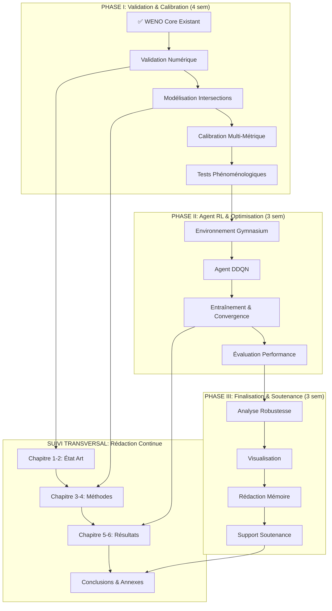

# **Feuille de Route d'Exécution Technique Actualisée - Projet Jumeau Numérique & RL**
### 28 Juillet - 10 Octobre 2025 (10 Semaines)

#### **Vue d'Ensemble - Flux de Travail et Dépendances Techniques**

---

## **📋 PHASE I : VALIDATION FONDAMENTALE & CALIBRATION** 
### **Durée :** 4 Semaines (28 Juillet - 25 Août)
**Objectif Stratégique :** Transformer le solveur WENO existant en simulateur de corridor validé et calibré.

---

#### **🔬 PHASE I.A - Validation Numérique Rigoureuse**
**Semaine 1 (28 juil. - 3 août) : Preuves Mathématiques de Correction**

**État Initial :** Solveur WENO5/SSP-RK3 implémenté ✅
**Objectif :** Prouver la validité numérique et lancer la collecte de données

**Livrables Techniques :**
- **I.A.1 [Validation Convergence]** `results/convergence_analysis.png`
  - *Graphique : Erreur L1 vs Δx avec pente confirmée > 2.5*
  - *Méthode de référence : Solutions analytiques ARZ*
- **I.A.2 [Test Conservation]** `results/conservation_test.png`
  - *Preuve : Erreur conservation masse/momentum < 1e-14*
  - *Validation positivité : ρ ≥ 0 maintenue strictement*
- **I.A.3 [Script Collecte]** `data/tomtom_collector.py` (déployé)
  - *Collecte automatisée données Lagos en tâche de fond*

**Livrables Rédaction :**
- **I.A.R1** Chapitre 1 (État de l'art) - Version draft complète
- **I.A.R2** Chapitre 2 (RL & Contexte) - Version draft complète

---

#### **🚦 PHASE I.B - Modélisation des Intersections**
**Semaine 2 (4 août - 10 août) : Infrastructure Réseau**

**Objectif :** Implémenter la gestion des flux aux jonctions multiples

**Livrables Techniques :**
- **I.B.1 [Modèle Jonction]** `numerics/JunctionSolver.py`
  - *Implémentation Supply-Demand avec matrices de répartition*
  - *Tests unitaires : conservation flux aux nœuds*
- **I.B.2 [Integration Test]** `test/test_network_stability.py`
  - *Validation : Pas d'instabilités numériques aux intersections*
- **I.B.3 [Corridor Setup]** `config/victoria_island_network.yml`
  - *Configuration géométrique complète du corridor d'étude*

**Livrables Rédaction :**
- **I.B.R1** Chapitre 3 (Modèle ARZ Étendu) - 60% complété
- **I.B.R2** Sections mathématiques : formulation intersections

---

#### **🎯 PHASE I.C - Calibration Multi-Métrique**
**Semaine 3 (11 août - 17 août) : Ancrage Données Réelles**

**Objectif :** Calibrer le modèle sur données TomTom collectées

**Livrables Techniques :**
- **I.C.1 [Analyse Qualité]** `analysis/data_quality_report.ipynb`
  - *Évaluation complétude, cohérence données Lagos*
  - *Identification patterns temporels et aberrations*
- **I.C.2 [Calibration]** `config/calibrated_parameters.yml`
  - *Paramètres optimisés : MAPE composite minimisée*
  - *Validation croisée sur périodes différentes*
- **I.C.3 [Métriques]** `results/calibration_metrics.png`
  - *Performance vs données réelles : R² > 0.85 visé*

**Livrables Rédaction :**
- **I.C.R1** Chapitre 4 (Implémentation Numérique) - 70% complété
- **I.C.R2** Chapitre 5 (Calibration) - Version draft

---

#### **🔍 PHASE I.D - Validation Phénoménologique**
**Semaine 4 (18 août - 25 août) : Tests de Réalisme Physique**

**Objectif :** Prouver la fidélité physique via scénarios critiques

**Livrables Techniques :**
- **I.D.1 [Scénario Choc]** `results/shockwave_validation.png`
  - *Onde de choc nette sans oscillations numériques*
  - *Comparaison avec modèles LWR (artefacts démontrés)*
- **I.D.2 [Scénario Congestion]** `results/jam_formation_test.png`
  - *Formation/dissipation embouteillages réaliste*
  - *Respect densité maximale ρ ≤ ρ_jam*
- **I.D.3 [Tests Robustesse]** `results/extreme_scenarios.png`
  - *Comportement stable conditions extrêmes*

**Livrables Rédaction :**
- **I.D.R1** Chapitre 5 (Calibration) - Version complète
- **I.D.R2** Chapitre 6 (Validation) - 50% complété

---

## **🤖 PHASE II : AGENT RL & OPTIMISATION INTELLIGENTE**
### **Durée :** 3 Semaines (26 Août - 15 Septembre)
**Objectif Stratégique :** Développer et entraîner l'agent RL performant.

---

#### **🎮 PHASE II.A - Environnement d'Apprentissage**
**Semaine 5 (26 août - 1er sept.) : Interface Gymnasium**

**Objectif :** Créer l'interface standardisée simulateur↔agent

**Livrables Techniques :**
- **II.A.1 [Environnement]** `environments/TrafficCorridorEnv.py`
  - *observation_space, action_space définitis*
  - *Fonctions step(), reset() testées*
- **II.A.2 [Fonction Récompense]** `environments/reward_function.py`
  - *Récompense multi-critères : débit + équité + stabilité*
  - *Tests unitaires sur cas limites*
- **II.A.3 [Integration Test]** `test/test_sim_env_coupling.py`
  - *Validation couplage simulateur-environnement*

**Livrables Rédaction :**
- **II.A.R1** Chapitre 6 (Validation) - Version complète
- **II.A.R2** Chapitre 7 (Agent RL) - Structure + intro

---

#### **🧠 PHASE II.B - Implémentation Agent DDQN**
**Semaine 6 (2 sept. - 8 sept.) : Architecture Neuronale**

**Objectif :** Construire l'agent d'apprentissage par renforcement

**Livrables Techniques :**
- **II.B.1 [Agent DDQN]** `agents/DDQNAgent.py`
  - *Architecture réseau neuronal optimisée*
  - *Replay Buffer et target network*
- **II.B.2 [Configuration]** `config/ddqn_hyperparams.yml`
  - *Hyperparamètres optimisés par grid search*
- **II.B.3 [Tests Unitaires]** `test/test_ddqn_components.py`
  - *Validation composants individuels agent*

**Livrables Rédaction :**
- **II.B.R1** Chapitre 7 (Agent RL) - 70% complété
- **II.B.R2** Sections techniques : architecture détaillée

---

#### **📈 PHASE II.C - Entraînement & Convergence**
**Semaine 7 (9 sept. - 15 sept.) : Apprentissage Supervisé**

**Objectif :** Entraîner l'agent jusqu'à convergence stable

**Livrables Techniques :**
- **II.C.1 [Logs Entraînement]** `runs/ddqn_training_logs/`
  - *TensorBoard : courbes récompense, loss, exploration*
- **II.C.2 [Modèle Final]** `models/ddqn_converged.pth`
  - *Agent entraîné avec politique stable*
- **II.C.3 [Analyse Convergence]** `analysis/training_analysis.ipynb`
  - *Validation convergence + métriques performance*

**Livrables Rédaction :**
- **II.C.R1** Chapitre 7 (Agent RL) - Version complète
- **II.C.R2** Chapitre 8 (Évaluation) - Structure + résultats préliminaires

---

## **🎯 PHASE III : FINALISATION & DÉMONSTRATION**
### **Durée :** 3 Semaines (16 Septembre - 10 Octobre)
**Objectif Stratégique :** Analyser, démontrer et communiquer les résultats.

---

#### **⚡ PHASE III.A - Analyse de Performance**
**Semaine 8 (16 sept. - 22 sept.) : Évaluation Quantitative**

**Objectif :** Prouver la supériorité de l'agent vs méthodes classiques

**Livrables Techniques :**
- **III.A.1 [Benchmark]** `analysis/performance_comparison.ipynb`
  - *Tableau KPIs : Agent RL vs Contrôle Fixe vs Adaptatif*
  - *Tests statistiques significativité*
- **III.A.2 [Robustesse]** `analysis/robustness_analysis.ipynb`
  - *Scénarios incidents + variations demande*
  - *Analyse sensibilité paramètres*
- **III.A.3 [Métriques]** `results/performance_dashboard.png`
  - *Visualisation gains performance multidimensionnels*

**Livrables Rédaction :**
- **III.A.R1** Chapitre 8 (Évaluation) - Version complète
- **III.A.R2** Discussion critique des résultats

---

#### **🎬 PHASE III.B - Visualisation & Démonstration**
**Semaine 9 (23 sept. - 29 sept.) : Communication Impactante**

**Objectif :** Créer supports visuels pour démonstration

**Livrables Techniques :**
- **III.B.1 [Visualiseur]** `visualizer/traffic_demo.html`
  - *Application web animation temps réel*
  - *Comparaison côte-à-côte RL vs Classique*
- **III.B.2 [Vidéo Demo]** `demo/final_demonstration.mp4`
  - *Vidéo narrative 3min : Problème→Solution→Impact*
- **III.B.3 [Figures Clés]** `figures/publication_ready/`
  - *Graphiques haute qualité pour mémoire*

**Livrables Rédaction :**
- **III.B.R1** Conclusion générale - Version complète
- **III.B.R2** Perspectives et recommandations

---

#### **📝 PHASE III.C - Sprint Final**
**Semaine 10 (30 sept. - 10 oct.) : Assemblage & Soutenance**

**Objectif :** Finaliser mémoire et préparer soutenance

**Livrables Finaux :**
- **III.C.1 [Mémoire Final]** `memoire_final.pdf`
  - *Document complet, relu, formaté conformément*
  - *Toutes figures/tableaux intégrés*
- **III.C.2 [Soutenance]** `soutenance_beamer.pdf`
  - *Présentation 20min selon plan défini*
  - *Vidéos/animations intégrées*
- **III.C.3 [Code Final]** Repository GitHub complet
  - *README détaillé + requirements.txt*
  - *Reproductibilité garantie*

**Livrables Rédaction :**
- **III.C.R1** Relecture finale + corrections
- **III.C.R2** Annexes techniques complètes

---

## **📊 SYSTÈME DE SUIVI TRANSVERSAL**

### **🎯 Indicateurs de Progression Hebdomadaires**
- **Technique :** % d'objectifs livrables atteints / semaine
- **Rédaction :** % de progression mémoire (par chapitre)
- **Qualité :** Nombre tests passés / tests totaux
- **Performance :** Métriques agent RL (si applicable)

### **⚠️ Points de Contrôle Critiques**
- **Fin Semaine 4 :** Simulateur validé → Go/No-Go Phase II
- **Fin Semaine 7 :** Agent convergent → Go/No-Go Phase III  
- **Fin Semaine 9 :** Mémoire 90% → Go/No-Go Finalisation

### **🔄 Stratégie de Mitigation des Risques**
- **Risque Technique :** Tests unitaires continus + validation incrémentale
- **Risque Temporel :** Priorisation stricte livrables critiques
- **Risque Qualité :** Revues hebdomadaires + feedback loops

---

## **📈 MÉTRIQUES DE SUCCÈS FINALES**

### **Critères Techniques Minimaux :**
- ✅ Simulateur : Convergence O(5), Conservation < 1e-12
- ✅ Agent RL : Convergence stable + Amélioration > 15% vs baseline
- ✅ Validation : R² > 0.8 sur données réelles

### **Critères Académiques :**
- ✅ Mémoire : 80-100 pages, conforme au plan imposé
- ✅ Contributions : 3 contributions clairement identifiées
- ✅ Reproductibilité : Code documenté + données/résultats archivés

**🎯 Date Limite Ferme : 10 Octobre 2025 - Soutenance prête**